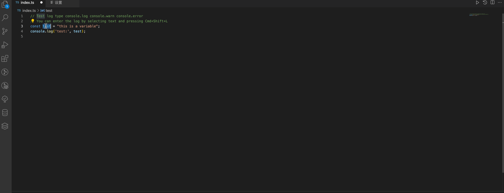

# ConsoleManager README

This is a front-end log Console Manager. Supports all languages running in JavaScript environments. Its purpose is to save efficiency in logging, debugging, and other tasks.

## Features

## Requirements

vscode version is up 1.74.0. This is running in JavaScript environments.

## Extension Settings

This extension contributes the following settings:

- `consoleManager.logType`: The type of log statement to insert
- `consoleManager.logPrefix`: The prefix for the log statement.

## Release Notes

### 0.0.1

Initial release of ConsoleManager, feature add and delete console.

### 0.0.3

fix image resources are not effective
